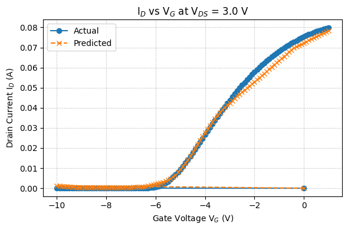
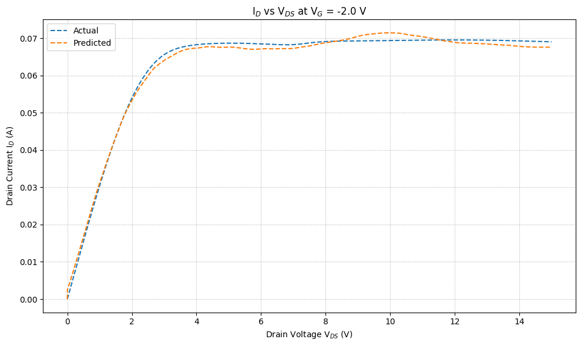

# 📡 HEMT I-V Characteristics Prediction using Artificial Neural Networks (ANN)

This project uses **Artificial Neural Networks (ANNs)** to predict the electrical characteristics of **High Electron Mobility Transistors (HEMTs)**. Instead of solving complex equations or using empirical models, this project leverages data-driven learning to model I-V relationships, specifically:
- I<sub>D</sub> vs V<sub>G</sub> (idvg)
- I<sub>D</sub> vs V<sub>D</sub> (idvd)

---

## 🧠 Project Objectives

- ✅ Use ANN to predict nonlinear I-V characteristics of HEMTs
- ✅ Train models using V<sub>GS</sub> and V<sub>DS</sub> as inputs
- ✅ Compare predicted drain current (I<sub>D</sub>) with actual values
- ✅ Visualize performance and regression accuracy

---

## 📁 Project Structure

hemt-ann-model/
├── notebooks/
│ ├── idvg_ANN.ipynb # ANN model for I_D vs V_G
│ └── idvd_ANN.ipynb # ANN model for I_D vs V_D
├── images/
│ ├── idvg_output.png # Plot showing predicted vs actual for idvg
│ └── idvd_output.png # Plot showing predicted vs actual for idvd
├── requirements.txt # Python libraries used
└── README.md # Project overview (this file)

---

## 📊 Output Plots

### 🔹 I<sub>D</sub> vs V<sub>G</sub> (Predicted vs Actual)



---

### 🔹 I<sub>D</sub> vs V<sub>D</sub> (Predicted vs Actual)



---

## 🚀 Getting Started

### 1. Clone the Repository

```bash
git clone https://github.com/your-username/hemt-ann-model.git
cd hemt-ann-model .

3. Run the Notebooks
Launch Jupyter Notebook:

bash
Copy
Edit
jupyter notebook notebooks/idvg_ANN.ipynb
# or
jupyter notebook notebooks/idvd_ANN.ipynb
